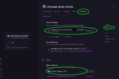

# WhatsApp Group Monitor

Self-hosted WhatsApp group activity monitor. Tracks group members, messages, reactions, polls, and events via a web dashboard.

## WhatsApp Account

This tool uses [Baileys](https://github.com/WhiskeySockets/Baileys), an open-source library that connects to WhatsApp as a linked device. No WhatsApp Business account or API subscription is needed — a regular WhatsApp account works.

You can use your own WhatsApp account or a dedicated one. The monitor connects as a linked device and passively tracks group activity without interfering with normal use.

If the service restarts, it automatically catches up on messages it missed while offline. However, if you disconnect (unlink the device) and re-connect, messages sent while disconnected will not be recovered.

## Deployment

### Railway

[](https://railway.com/deploy/whatsapp-group-monitor?referralCode=5IPNhU&utm_medium=integration&utm_source=template&utm_campaign=generic)

Click the button above to deploy. The template sets up the volume and exposes HTTPS automatically. You only need to set `ADMIN_PASSWORD` during setup.

Once deployed, navigate to the service Settings page on Railway and copy the URL from Public Networking. You can also change the region if you wish.

[](pix/railway-settings.png)


### Docker

```bash
cp .env.example .env
# Edit .env: set ADMIN_PASSWORD
docker compose up --build
```

Data is persisted in a named Docker volume.

### Local

Requires Node.js 22+ and npm.

```bash
npm install
cp .env.example .env
# Edit .env: set ADMIN_PASSWORD
npm run dev
```

## Getting Started

1. Open the web panel and log in
2. Scan the QR code with WhatsApp (Linked Devices > Link a Device)
3. The dashboard shows all groups the account is in, with member counts and activity stats

## Environment Variables

| Variable | Default | Description |
|----------|---------|-------------|
| `ADMIN_PASSWORD` | *(required)* | Password for the web panel |
| `ADMIN_USERNAME` | `admin` | Username for the web panel |
| `PORT` | `3000` | Web server port |
| `DATA_DIR` | `./data` | Directory for auth state and database |
| `LOG_LEVEL` | `info` | `debug`, `info`, `warn`, `error` |

Additional settings (project name, page size) are configurable from the Settings page.

## Data Isolation

Each WhatsApp account gets its own database at `data/{phone}/account.db`. Disconnecting and connecting a different number creates a separate database — no data mixing between accounts. Shared settings are stored in `data/monitor.db`.

Only one WhatsApp account can be connected at a time. Activity is only tracked while the account is connected. If you need to monitor multiple accounts simultaneously, set up a separate instance (container) for each one.

## Tech Stack

Baileys (WhatsApp Web) + Fastify + SQLite (better-sqlite3) + Drizzle ORM + TypeScript

## License

[MIT](LICENSE)
